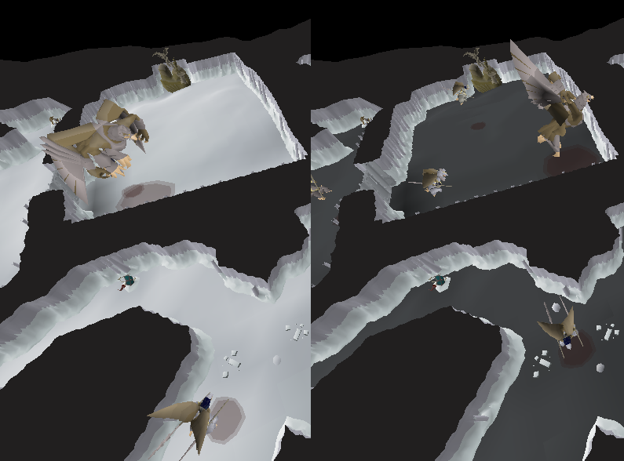
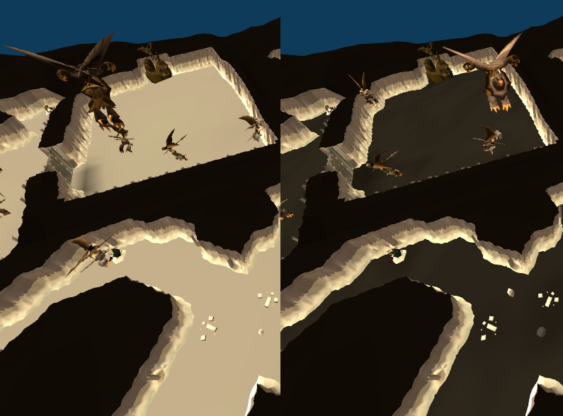

# World Recolor

Change the lightness and colors of the world more to your liking.  
Compatible with GPU and 117 HD plugins!

**TIP**: Use with the "Low Detail" or "Ground Object Hider" plugins to hide ground objects such as rocks for 
a better look when using recolored tiles.

## Current features
* Reduce lightness of tiles
* Change hue and saturation values of tiles

## Possible future features
* Recolor tile colors on the minimap
* Recolor walls
* Recolor game objects
* Recolor ground objects

## Not considered
* Recoloring textures (water, lava, etc.)
* Recoloring animated objects (waterfalls, geysers, etc.)

## Examples

GPU plugin, 90% tile lightness reduction (left without, right with):

117 HD plugin, 90% tile lightness reduction (left without, right with):

